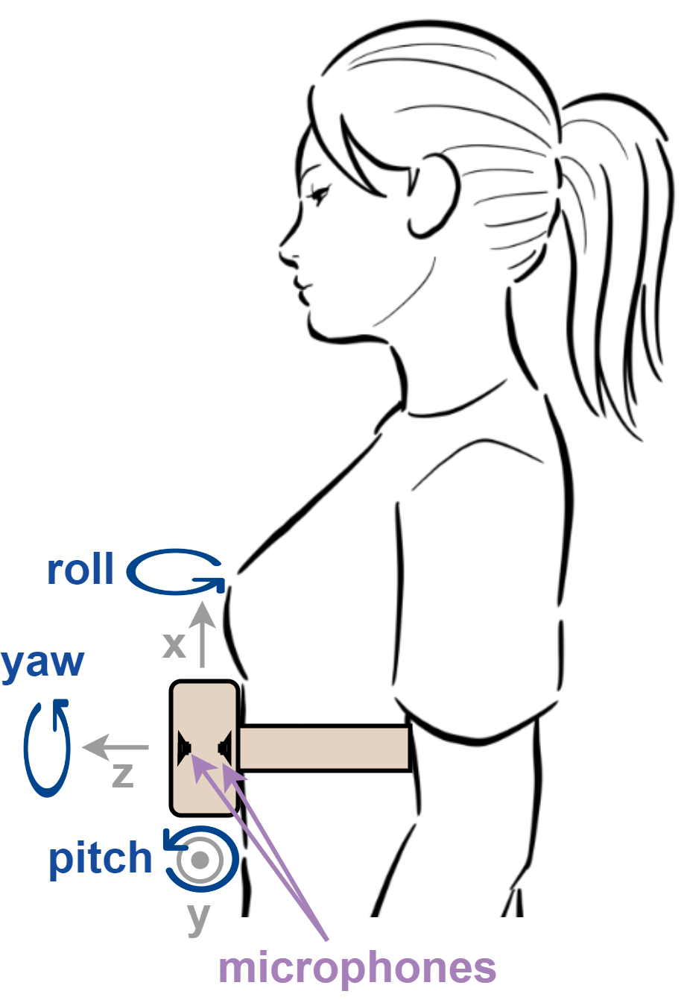

To advance the field of automatic cough counting and enable a fair comparison of different algorithms, we contribute the first publicly accessible, finely-labeled cough biosignal dataset. The public dataset contains 227 minutes of biosignals and nearly 4,300 annotated cough events.

## Data access

The dataset can be downloaded from this [Zenodo database](https://zenodo.org/records/7562332).

## Data collection

### Signals 
The dataset contains biosignals collected using a nocel lightweight, battery-powered device containing the following sensors:
* Acoustic - two microphones - one facing toward the body and one facing away from it - each sampled at 16 kHz
* Kinematic - an interial measurement unit - containing accelerometer and gyroscope signals - sampled at 100 Hz



### Subjects

Recordings were collected from 15 healthy subjects (10 male, 10 female; age 26.5 ± 6.5 years; body mass index (BMI) 22.6 ± 4.5 kilograms per square meter). Institutional review board approval was obtained (HREC No.: 085-2022) and all participants signed an informed consent prior to data acquisition. 


### Non-cough sounds

In addition to coughs, the subjects produced the following sounds that could possibly be confused with coughing:
* Laughing
* Throat clearing
* Deep breathing

### Environmental noise

To assess how well classifiers perform under real-life noise conditions, several noise factors were intentionally added to the experimental setup. These noises came in the form of audio and kinematic noise.

Audio noise:
* Traffic
* Music
* Bystander cough

Kinematic noise:
* Walking

## Dataset structure

The files are arranged in a hierarchical structure as shown in the figure below. For each experimental condition, there are three to four corresponding files: .wav audio files for the body-facing and outward-facing microphones, a .csv file for the IMU data, and in the case of cough recordings, a .json file containing the cough location annotations.  The gender and BMI of each subject are recorded in the biodata.json file.


```txt
Subject ID/
├── Trial 1/
│   ├── Sit/
│   │   ├── No noise
|   |   |    ├── Cough
│   │   |    |   ├── body-facing-mic.wav
│   │   |    |   ├── outward-facing-mic.wav
│   │   |    |   ├── imu.csv
│   │   |    |   └── ground-truth.json
|   |   |    ├── Laugh
│   │   |    |   ├── ...
|   |   |    ├── Deep breathing
│   │   |    |   ├── ...
|   |   |    └── Throat clearing
│   │   |        ├── ...
|   |   ├── Traffic
│   │   |    ├── ...
|   |   ├── Music
│   │   |    ├── ...
|   |   ├── Bystander cough
│   │   |    ├── ...
│   ├── Walk
│   │   ├── ...
|   ├── biodata.json
| ...
```