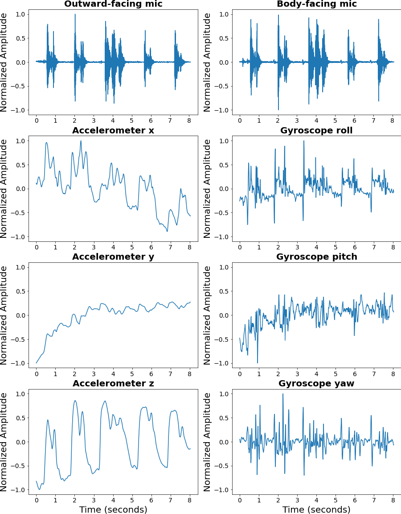
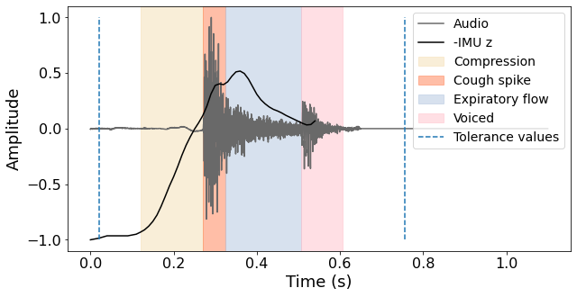
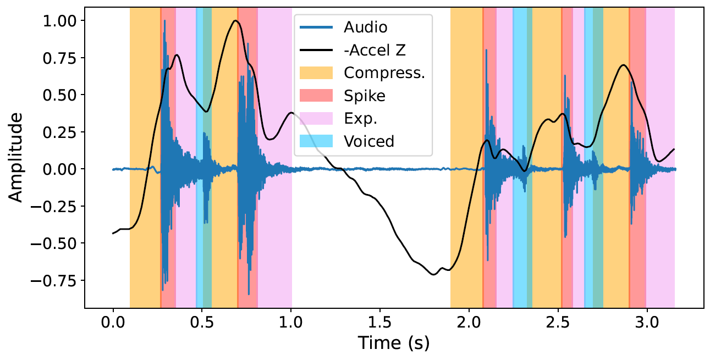
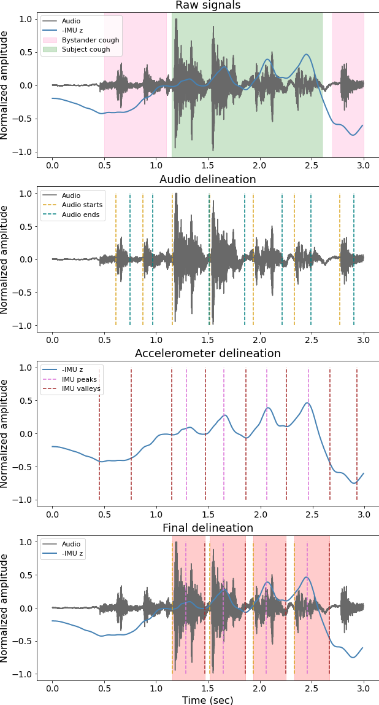

## Cough definition

In order to be able to count cough events, the research community first needs a clear definition of how to identify a cough event. In this work, we define a cough as a forceful burst of air through the lungs and throat. The physiological mechanism of the cough results in both an inward motion of the chest required to propel the air and mucus out of the lungs, as well as a sound due to the vibration of the large airways and laryngeal structures during turbulent flow in expiration. 

The figure below depicts 9 cough events measured through a chest-worn device containing two microphones and an inertial measurement unit. Each individual cough can be identified through large peaks in the audio signals coinciding with peaks in the accelerometer z signal, which depicts the motion in and out of the chest.

## Phases of a cough

Cough events can be divided into a series of phases, described by [Chang et al.](https://www.sciencedirect.com/science/article/pii/S1526054205001107):
1. (occasional) Inspiratory - Air is inhaled to enable lengthening of the expiratory muscles. One inhalation can be followed by one or multiple cough events.
2. Compressive - The glottis is closed to enable building of intrathoracic pressure. It typically lasts approximately 200 ms.
3. Cough spike - Opening of the glottis, followed by supramaximal expiratory flow, which causes the loudest part of the cough sound. This typically lasts 30-50 ms.
4. Expiratory - Air and debris exit the lungs through expiration lasting 200-500 ms. 
5. (optional) Voiced - Some coughs are accompanied by a sound eminating from the vocal chords, often causing another peak in the audio signal.

The various cough phases can be visualized in the audio and kinematic signals below.

Furthermore, the figure below depicts the various cough phases in two series of coughs, also known as cough bursts, separated by a breath.

## Data annotation guidelines

Determining how well an algorithm counts coughs requires an extensive, fine-grained annotation of the cough recordings that marks the start and endpoints of each individual cough sound. To this end, we propose the following data annotation procedure that takes into account the aforementioned cough phase physiology, as well as the dual modalities of cough signal artefacts.

The first step of the annotation involves extracting relevant fiducial points of the microphone and accelerometer z-direction signals. First, the starts and ends of each audio event are visually identified as the start of the largest peak in the audio signal to the end of the gradual decrease of the signal down to its noise floor. This aims to identify the combined cough spike, expiratory, and voiced phase of each cough.

However, the audio signal alone cannot accurately delineate coughs, as it may pick up high-amplitude noises as well as bystander coughs. This is why it is also advisable to delineate the peaks and valleys of the accelerometer z signal to determine whether each sound burst was accompanied by a chest acceleration. Mathematically, peaks and valleys can defined as local minima and maxima of the second derivative of the signal, respectively. The final cough location can then be determined as the start and end locations of audio events, provided that they are accompanied by a peak in the chesta accelerometer signal.

As an illustrative example, let us consider the recording in the figure below, which shows two bystander coughs followed by four of the subject’s coughs, then one more bystander cough. We can see from the fiducial points that the audio signal thresholding mistakenly identifies the bystander coughs, while the IMU signal exhibits a peak at every true cough but does not adequately mark the onset of the cough. In this example recording, the final annotation is selected as the regions between audio burst starts and IMU valleys
containing an IMU peak in-between.

