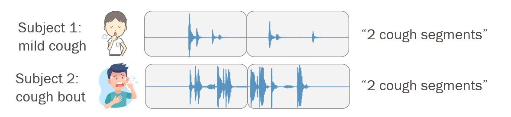
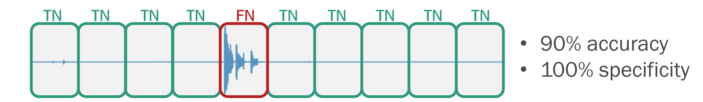
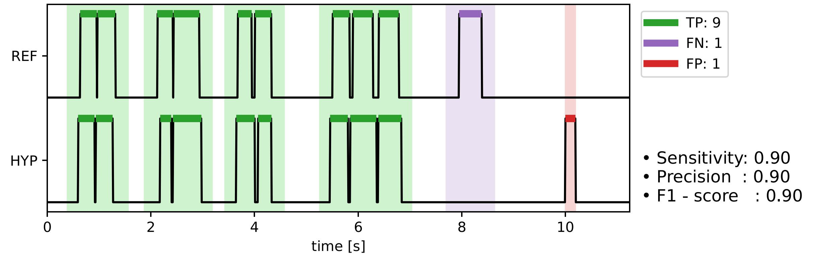

## Goals for objective cough monitoring 

The [guidelines of the European Respiratory Society (ERS)](https://publications.ersnet.org/content/erj/29/6/1256) highlight multiple clinically significant endpoints in cough monitoring, including: 
1) the number of cough events, 
2) seconds containing at least one cough, 
3) breaths followed by coughing 
4) cough bouts, which are sequences of coughs that are not separated by a breath

Studying the pattern of coughing is crucial, as cough bouts correlate more closely than individual coughs with pathology and reported severity, and can indicate different underlying physiological mechanisms, according to [Dockry et al](https://thorax.bmj.com/content/77/Suppl_1/A14.2). Thus, automated tools should monitor both cough frequency and the temporal distribution of cough patterns to provide insights into the patient’s symptomatology and guide treatment plans.

### How are current works reporting results? 

There are two main gaps between reported algorithm performance metrics and the above-mentioned clinically relevant endpoints. These gaps relate to what counts as a "correct" cough sample, as well as which metrics are reported to measure algorithm performance.

Typically, recordings are segmented into windows of a fixed length, which are often seconds-long and therefore can contain multiple coughs. A sample is determined to be cough-positive if one or more coughs appear in the window. The figures below depict two recordings, each segmented into two windows.

We can see a few problems already. First, even though the second subject has more coughs than the first, the algorithm scores them equally, so the temporal distribution of the cough events is lost information. Second, depending on the window length, the sample can contain a fraction of a cough, a full cough, or multiple coughs, so it is impossible to compare the success of two algorithms that are based on two different segmentation methods.

The second problem is that metrics based on True Negative (TN) samples are often reported to evaluate algorithm success. However, TNs may misrepresent practicality as they are heavily influenced by cough frequency and long periods without coughs, and therefore do not contribute useful information in a long-term monitoring scenario. For example, take the case of the image below, which depicts a very basic classifier that never detects a cough. 

In this signal that contains more silence than coughing, the classifier scores quite well: 90% accuracy and 100% specificity. However, this algorithm isn't giving any useful information to doctors who want to know whether a given medication is making their patients cough more or less.

It is therefore imparative that we redifine how success is evaluated in the context of cough counting. To do this, we have two propositions.

## Proposition 1: Event-based evaluation framework

In order to overcome the issues with evaluating algorithm success based on data windows, we propose an event-based framework to truly evaluate how well algorithms detect each individual cough event. An example of an algorithm performance evaluation is shown below, in which reference cough event lications (REF) are compared to the hypothesized ones (HYP).

Unlike window-based metrics, these event-based metrics measure the ability of an algorithm to correctly identify the temporal locations of annotated events. True positive events are determined based on the overlap between individual true and predicted cough events, including some tolerance around the ground-truth locations. We suggest using a tolerance value of 0.25 s, which corresponds to the time required for the lungs to compress before a cough, as well as the minimum expiratory phase following a cough. For more information about these the different phases of coughs used to set these thresholds, check out our [cough event definition page]().

Overall, we propose an eventbased evaluation framework to identify individual cough onsets and offsets, providing precise information on cough patterns to assess disease severity and treatment efficacy.

## Proposition 2: Reporting meaningful algorithm performance metrics

Traditional metrics like Specificity and Accuracy,
used in [over 60% of studies](https://www.mdpi.com/1424-8220/22/8/2896  ), are highly sensitive to class
imbalance present in the dataset. 

We strongly recommend
using Sensitivity, Precision, F-1 Score, and False Positives
per hour for evaluation. These metrics are based on true positive, false negative, and false positive samples, and therefore cannot be saturated by TNs.
